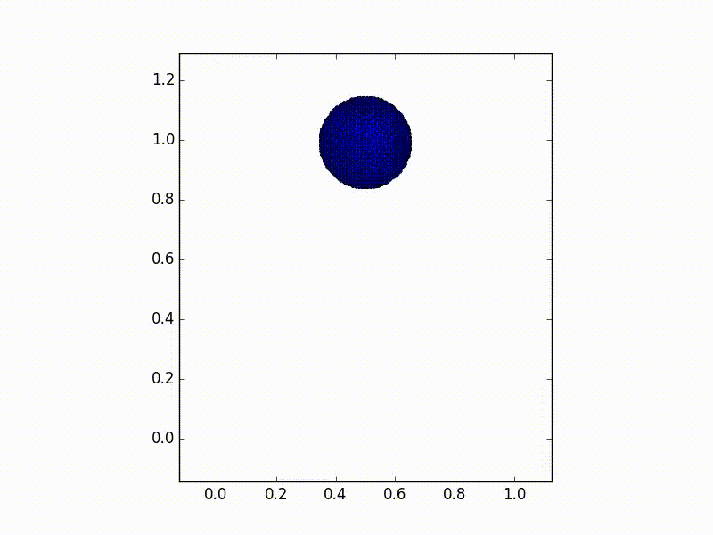

# Hello, Jet!

This document will show you basic steps for creating fluid simulation using Jet framework. In the end, we will have simple, but complete fluid animation code.

## Using Jet

Jet framework is a C++ library. To start developing with Jet, begin with including the header files to your C++ source files such as:

    #include <jet/jet.h>

This will import all the headers needed into your code. After writing up the code, link your program with `libjet.a` (or `jet.lib` for Windows). These are all the stuff you will need for the development.

## Solver

Jet provides several different fluid solvers. In this example, let's use FLIP solver, which is a grid-particle hybrid simulator. Instantiating a FLIP solver is simple. Just write:

        auto solver = FlipSolver3::builder()
            .withResolution({32, 64, 32})
            .withDomainSizeX(1.0)
            .makeShared();

This will create a solver with 32 x 64 x 32 resolution grid container that has size of 1m x 2m x 1m. The solver alone, however, won't do anything interesting. We need to pour some fluid into the solver using emitters.

## Emitter

We use similar builder pattern for creating an emitter as well. To build an emitter, we first need its shape. So, check out the following:

        auto sphere = Sphere3::builder()
            .withCenter({0.5, 1.0, 0.5})
            .withRadius(0.15)
            .makeShared();

This will create a sphere shape. Let's use this geometry to create an emitter such as:

        auto emitter = VolumeParticleEmitter3::builder()
            .withSurface(sphere)
            .withSpacing(1.0 / 128.0)
            .makeShared();

By specifying the shape and spacing between particles, we now have a particle emitter. To hook that up to the solver, simply call:

    solver->setParticleEmitter(emitter);

Now, we have our basic scene setup. Let's give some life to it.

## Animation

To perform the simulation, write a code something like:

    for (Frame frame; frame.index < 120; ++frame) {
        solver->update(frame);
    }

This simple for-loop updates the solver every frame until it reaches 120 frame count. By default, the time interval between frames is 1/60 sec. So this loop will create 2 seconds-worth of animation.

## Putting together

Below is the code that puts everything together into a single program.

    #include <jet/jet.h>

    using namespace jet;

    int main() {
        auto solver = FlipSolver3::builder()
            .withResolution({32, 64, 32})
            .withDomainSizeX(1.0)
            .makeShared();

        auto sphere = Sphere3::builder()
            .withCenter({0.5, 1.0, 0.5})
            .withRadius(0.15)
            .makeShared();

        auto emitter = VolumeParticleEmitter3::builder()
            .withSurface(sphere)
            .withSpacing(1.0 / 128.0)
            .makeShared();

        solver->setParticleEmitter(emitter);

        for (Frame frame; frame.index < 120; ++frame) {
            solver->update(frame);
        }

        return 0;
    }

This code is a full fluid dynamics simulation using approximately 60k particles. The generated animation looks like below.

We haven't talked about a collider, which is another key actor in fluid animations. To the code above, you can add the following lines to add a simple collider:

    auto anotherSphere = Sphere3::builder()
        .withCenter({0.5, 0.5, 0.5})
        .withRadius(0.15)
        .makeShared();

    auto collider = RigidBodyCollider3::builder()
        .withSurface(anotherSphere)
        .makeShared();

    solver->setCollider(collider);

This will create an animaiton like below:

That's it! This is the basics of creating a simulation using Jet. For more examples, check out `src/examples` for more sample codes.
