# Introduction

To test and demonstrate the features of Jet, the SDK comes with a manual test application. The tests are generally more complicated than the unit tests that involves longer run time and collection of API calls. The manual tests are closer to the real-world use cases, so it is useful to take them as SDK examples. The tests normally output data files which can often be rendered into images or even movie clips

To list the entire test cases from Mac OS X or Linux, run

```
bin/list_manual_tests
```

or for Windows, run

```
bin\list_manual_tests.bat
```

Similar to the unit test, run the following command to run entire tests for Mac OS X and Linux:

```
bin/manual_tests <name_of_the_test>
```

For Windows, run

```
bin\manual_tests.bat <name_of_the_test>
```

You can run the entire tests by not specifying the name of the test. However, it will cost more than an hour of execution time since the manual test includes quite intensive tests such as running multiple fluid simulations. Thus, it is recommended to run specific tests for the fast debugging, and then run the entire tests for final validation. Similar to the unit test, you can also use patterns for specifying the tests such as:

```
bin/manual_tests AnimationTests.*
```

Again, replace `bin/manual_tests` with the `.bat` command for Windows.


The test results will be located at `manual_tests_output/TestName/CaseName/file`. To validate the results, you need [Matplotlib](http://matplotlib.org/). The recommended way of installing the latest version of the library is to use `pip` such as:

```
pip install matplotlib
```

The modern Python versions (2.7.9 and above) comes with `pip` by default. Once Matplotlib is installed, run the following:

```
bin/render_manual_tests_output
```

Once renderered, the rendered image will be stored at the same directory where the test output files are located (`manual_tests_output/TestName/CaseName/file`). Also, to render the animations as mpeg movie files, [ffmpeg](https://www.ffmpeg.org/) is required for Mac OS X and Windows. For Linux, [mencoder](http://www.mplayerhq.hu/) is needed. For Mac OS X, ffmpeg can be installed via Homebrew. For Windows, the executable can be downloaded from the [website](https://www.ffmpeg.org/). For Ubuntu, you can use `apt-get`.

For example, after running the following commands:

```
bin/manual_tests AnimationTests.OnUpdateSine
bin/render_manual_tests_output
```

you can find

```
manual_tests_output/Animation/OnUpdateSine/data.#line2.mp4
```

is generated.

# List of the Tests

Below is the list of the tests and their expected results.

* SemiLagrangian2Tests.
    * Boundary

        Before and after advection:

        
        

    * Zalesak

        Before and after advection:

        
        

* CubicSemiLagrangian2Tests.
    * Zalesak

        Before and after advection:

        
        

* AnimationTests.
    * OnUpdateSine

        

    * OnUpdateSineWithDecay

        

* ArrayUtilsTests.
    * ExtralateToRegion2

* ScalarField3Tests.
    * Sample

        

    * Gradient

        

    * Laplacian

        

* VectorField3Tests.
    * Sample

        

    * Divergence

        

    * Curl

        

    * Sample2

        Testing sample function with different field.

        

* FlipSolver2Tests.
    * Empty

    * SteadyState

        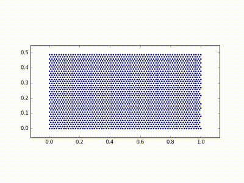

    * DamBreaking

        

    * DamBreakingWithCollider

        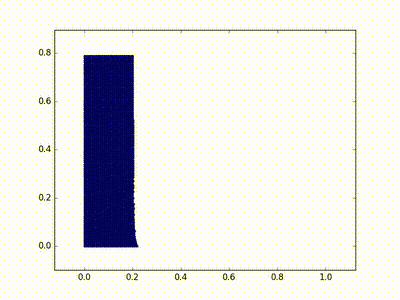

* FlipSolver3Tests.
    * WaterDrop

        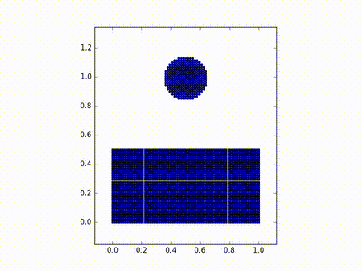

    * DamBreakingWithCollider

        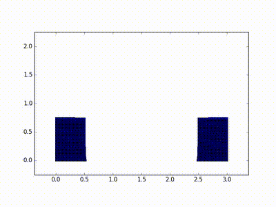

* FmmLevelSetSolver2Tests.
    * ReinitializeSmall

        2-D FMM test on low-resolution grid.

        Reinitializing constant field (should result the same constant field), before and after:

        
        

        Reinitializing SDF (should result nearly the same SDF), before and after:

        
        

        Reinitializing 2x scaled SDF (should result 1x scale SDF), before and after:

        
        

        Reinitializing unit step function (should result 1x scale SDF), before and after:

        
        

    * Reinitialize

        2-D FMM test on high-resolution grid.

        Reinitializing constant field (should result the same constant field), before and after:

        
        

        Reinitializing SDF (should result nearly the same SDF), before and after:

        
        

        Reinitializing 2x scaled SDF (should result 1x scale SDF), before and after:

        
        

        Reinitializing unit step function (should result 1x scale SDF), before and after:

        
        

    * Extrapolate

        Input and output field:

        
        

        Background signed-distance field:

        

* FmmLevelSetSolver3Tests.
    * ReinitializeSmall

        Input and output field (cross-sectional view):

        
        

    * ExtrapolateSmall

        Input and output field (cross-sectional view):

        
        

* GridBlockedBoundaryConditionSolver2Tests.
    * ConstrainVelocitySmall

        Constrained velocity and boundary marker:

        
        

    * ConstrainVelocity

        Constrained velocity and boundary marker:

        
        

    * ConstrainVelocityWithFriction

        Constrained velocity and boundary marker:

        
        

* GridFractionalBoundaryConditionSolver2Tests.
    * ConstrainVelocity

        Constrained velocity:

        

* GridForwardEulerDiffusionSolver3Tests.
    * Solve

        Diffusion applied to the entire domain with small diffusion coefficient.

        
        

    * Unstable

        Diffusion applied to the entire domain with large diffusion coefficient.

        
        

* GridBackwardEulerDiffusionSolver2Tests.
    * Solve

        Diffusion applied to the half of the domain with very large diffusion coefficient.

        Input and output field:

        
        

* GridBackwardEulerDiffusionSolver3Tests.
    * Solve

        Diffusion applied to the entire domain with small diffusion coefficient.

        Input and output field:

        
        

    * Stable

        Diffusion applied to the entire domain with large diffusion coefficient.

        Input and output field:

        
        

    * SolveWithBoundaryDirichlet

        Diffusion applied to the half of the domain using Dirichlet boundary condition with very large diffusion coefficient.

        Input and output field:

        
        

    * SolveWithBoundaryNeumann

        Diffusion applied to the half of the domain using Neumann boundary condition with very large diffusion coefficient.

        Input and output field:

        
        

* GridFluidSolver2Tests.
    * ApplyBoundaryConditionWithPressure

        When right-facing velocity field is applied, solve the incompressible flow. In this test case, use closed boundary. Zero velocity field expected.

        Velocity (the arrows may be scaled even if their absolute magnitude is very small. See divergence for better analysis):

        

        Divergence:

        

        Pressure:

        

    * ApplyBoundaryConditionWithVariationalPressure

        When right-facing velocity field is applied, solve the incompressible flow. In this test case, use closed boundary. To solve boundary condition, the fractional (or often called variational) method is used. Div-free flow around the boundary is expected.

        Velocity (the arrows may be scaled even if their absolute magnitude is very small. See divergence for better analysis):

        

        Divergence:

        

        Pressure:

        

    * ApplyBoundaryConditionWithPressureOpen

        When right-facing velocity field is applied, solve the incompressible flow. In this test case, use open (left and right) boundary. Div-free flow around the boundary is expected.

        Velocity (the arrows may be scaled even if their absolute magnitude is very small. See divergence for better analysis):

        

        Divergence:

        

        Pressure:

        

* GridSmokeSolver2Tests.
    * MovingEmitterWithCollider

        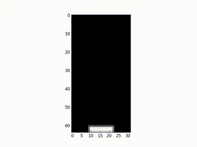

    * Rising

        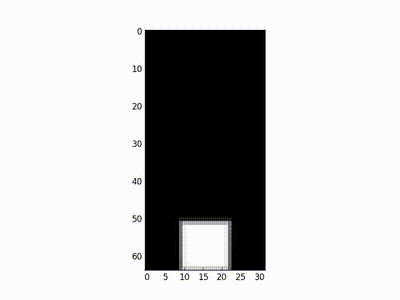

    * RisingWithCollider

        

    * RisingWithColliderNonVariational

        

    * RisingWithColliderAndDiffusion

        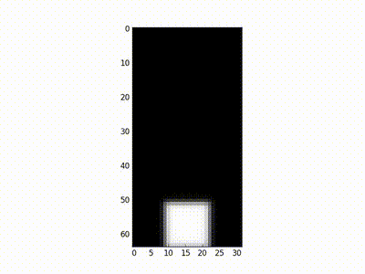

* GridSmokeSolver3Tests.
    * Rising

        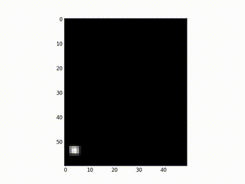

    * RisingWithCollider

        

    * RisingWithColliderLinear

        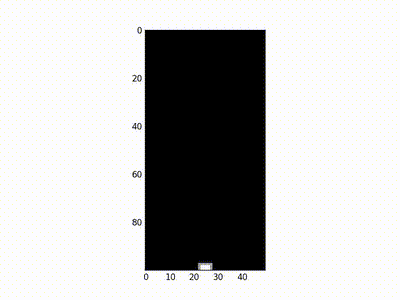

* HelloFluidSimTests.
    * Run

        

* LevelSetSolver2Tests.
    * Reinitialize

        Input and output level set field when advection and reinitialization combined:

        
        

        Background flow field:

        

    * NoReinitialize

        Input and output level set field with advection but without reinitialization:

        

* UpwindLevelSetSolver2Tests.
    * ReinitializeSmall

        2-D iterative upwind-based level set solver test on low-resolution grid.

        Reinitializing constant field (should result the same constant field), before and after:

        
        

        Reinitializing SDF (should result nearly the same SDF), before and after:

        
        

        Reinitializing 2x scaled SDF (should result 1x scale SDF), before and after:

        
        

        Reinitializing unit step function (should result 1x scale SDF), before and after:

        
        

    * Reinitialize

        2-D iterative upwind-based level set solver test on high-resolution grid.

        Reinitializing constant field (should result the same constant field), before and after:

        
        

        Reinitializing SDF (should result nearly the same SDF), before and after:

        
        

        Reinitializing 2x scaled SDF (should result 1x scale SDF), before and after:

        
        

        Reinitializing unit step function (should result 1x scale SDF), before and after:

        
        

    * Extrapolate

        Input and output field:

        
        

        Background signed-distance field:

        

* UpwindLevelSetSolver3Tests.
    * ReinitializeSmall

        Input and output field (cross-sectional view):

        
        

    * ExtrapolateSmall

        Input and output field (cross-sectional view):

        
        

* EnoLevelSetSolver2Tests.
    * ReinitializeSmall

        2-D iterative ENO-based level set solver test on low-resolution grid.

        Reinitializing constant field (should result the same constant field), before and after:

        
        

        Reinitializing SDF (should result nearly the same SDF), before and after:

        
        

        Reinitializing 2x scaled SDF (should result 1x scale SDF), before and after:

        
        

        Reinitializing unit step function (should result 1x scale SDF), before and after:

        
        

    * Reinitialize

        2-D iterative ENO-based level set solver test on high-resolution grid.

        Reinitializing constant field (should result the same constant field), before and after:

        
        

        Reinitializing SDF (should result nearly the same SDF), before and after:

        
        

        Reinitializing 2x scaled SDF (should result 1x scale SDF), before and after:

        
        

        Reinitializing unit step function (should result 1x scale SDF), before and after:

        
        

    * Extrapolate

        Input and output field:

        
        

        Background signed-distance field:

        

* EnoLevelSetSolver3Tests.
    * ReinitializeSmall

        Input and output field (cross-sectional view):

        
        

    * ExtrapolateSmall

        Input and output field (cross-sectional view):

        
        

* LevelSetLiquidSolver2Tests.
    * Drop

        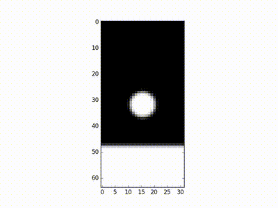

    * DropHighRes

        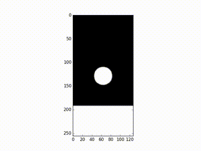

    * DropWithCollider

        

    * DropVariational

        

    * DropWithColliderVariational

        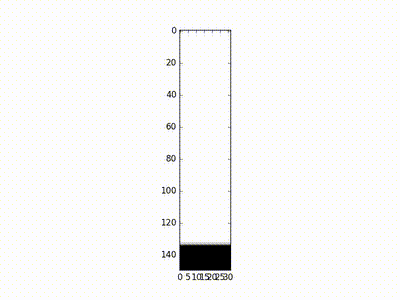

    * ViscousDropVariational

        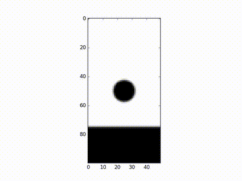

    * DropWithoutGlobalComp

        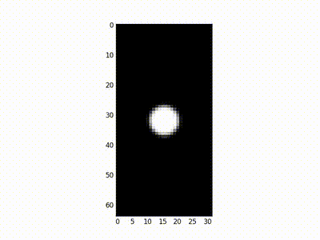

    * DropWithGlobalComp

        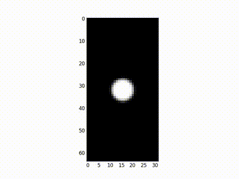

* LevelSetLiquidSolver3Tests.
    * SubtleSloshing

        The simulation should correctly generate sloshing animation even with subtle slope of the initial geometry.

        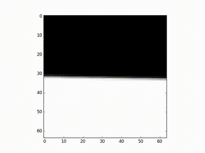

* MarchingCubesTests.
    * SingleCube

        

    * FourCubes

        

    * Sphere

        

* ParticleSystemSolver2Tests.
    * Update

        

* ParticleSystemSolver3Tests.
    * PerfectBounce

        

    * HalfBounce

        

    * HalfBounceWithFriction

        

    * NoBounce

        

    * Update

        

* PciSphSolver2Tests.
    * SteadyState

        

    * WaterDrop

        

* PciSphSolver3Tests.
    * SteadyState

        

    * WaterDrop

        

* PhysicsAnimationTests.
    * SimpleMassSpringAnimation

        

* PicSolver2Tests.
    * Empty

    * SteadyState

        

    * DamBreaking

        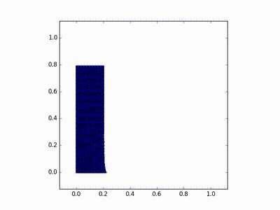

    * DamBreakingWithCollider

        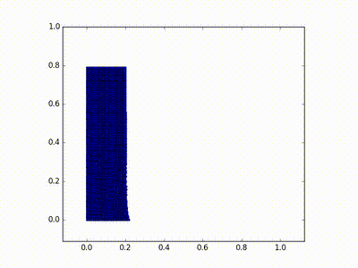

* PicSolver3Tests.
    * DamBreakingWithCollider

        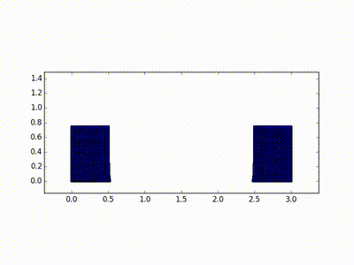

    * WaterDrop

        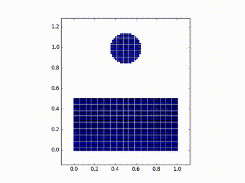

* PointHashGridSearcher2Tests.
    * Build

        

* PointHashGridSearcher3Tests.
    * Build

        

* PointParallelHashGridSearcher2Tests.
    * Build

        

* PointParallelHashGridSearcher3Tests.
    * Build

        

* SphStdKernel3Tests.
    * Operator

        Kernel radius h = 1, 1.2, 1.5

        
        
        

* SphSpikyKernel3Tests.
    * Derivatives

        Standard kernel and its 1st and 2nd derivatives:

        
        
        

        Spiky kernel and its 1st and 2nd derivatives:

        
        
        

* SphSolver2Tests.
    * SteadyState

        

    * WaterDrop

        

    * WaterDropLargeDt

        Should give unstable result:

        

* SphSolver3Tests.
    * SteadyState

        

    * WaterDrop

        

* SphSystemData2Tests.
    * Interpolate

        

    * Gradient

        
        

    * Laplacian

        
        

* SphSystemData3Tests.
    * Interpolate

        

    * Gradient

        
        

    * Laplacian

        
        

* TriangleMesh3Tests.
    * PointsOnlyGeometries
    * PointsAndNormalGeometries
    * BasicIO

* TriangleMeshToSdfTests.
    * Cube

        

    * Bunny
    * Dragon

* VolumeParticleEmitter2Tests.
    * EmitContinuousNonOverlapping

        

* VolumeParticleEmitter3Tests.
    * EmitContinuousNonOverlapping

        
